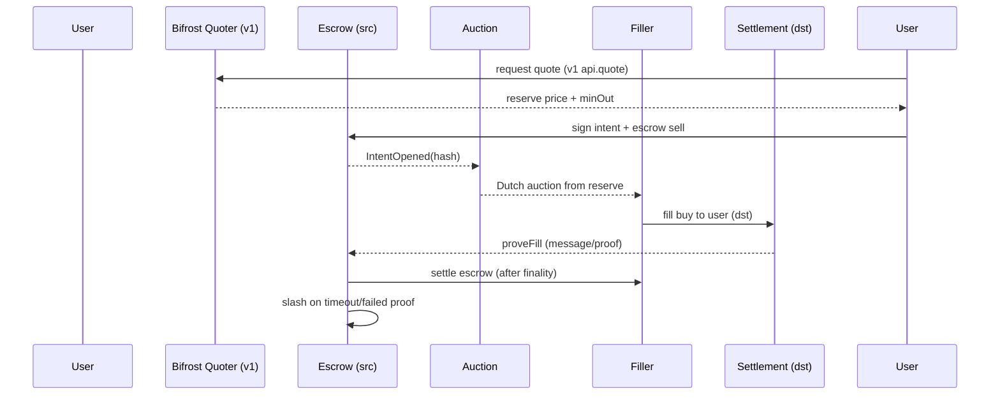

# Intent Model B — Deferred Design (v2)

Status: **design-only**. v1 ships Model A (direct, non-custodial). This doc
preserves the decision context and specifies B so v1 code needs no breaking
changes to adopt it later. v2 scope adds HyperEVM + HYPE alongside Eth + Base.

## 1. Why B later

Model A (user signs each hop) is optimal for launch: no filler set, no escrow
contracts, auditable. Its limits — N signatures, N gas txs, user-held revert /
bridge-delay risk, no private-inventory price improvement — are exactly what B
solves with a single signed intent filled competitively.

## 2. Intent struct (EIP-712)

```python
@dataclass(frozen=True)
class Intent:
    user: str            # EOA / smart account
    src_chain: int       # e.g. 1
    dst_chain: int       # e.g. 8453
    sell: str            # "1:USDC"
    buy: str             # "8453:WETH"
    amount_in: float
    min_out: float       # from v1 quote() * (1 - slippage_tol)
    deadline: int        # unix ts; Fastest pref -> short deadline
    nonce: int
    preference: str      # max_output | fastest | cheapest (auction params)
```

Signed once. Fillers compete; winner fills on destination, proves fill, claims
escrowed input on source.

## 3. Contracts (one escrow per chain)

- `BifrostSettlement.sol` deployed on Eth, Base (v2: HyperEVM).
  - `deposit(intentHash, amountIn)` — user (or Permit2) escrows sell asset.
  - `fill(intentHash, filler, amountOut)` — filler sends buy asset to user on dst.
  - `proveFill(...)` — ZKP / bridge-message / optimistic-challenge proof relayed
    back to source chain.
  - `settle(intentHash)` — releases escrow to filler after finality window.
  - `slash(intentHash)` — filler posted collateral; slashed on missed deadline
    or failed proof. Collateral sized by `risk_score` of route (reuse v1 edge
    risk: Across < Stargate < native).
- Finality: source release waits `finality_blocks[dst]` (Eth deep, Base fast,
  HyperEVM per spec). Reorgs: optimistic window + `proveFill` must reference a
  finalized header; challengers can dispute within window.

## 4. Auction (Dutch, preference-aware)

1. v1 `quote()` computes reserve price: `expected_out` of best direct route.
   Auction starts at `reserve * (1 + premium)` decaying to `min_out`.
2. `MaxOutput`: slow decay, long deadline — maximizes filler competition.
   `Fastest`: fast decay, short deadline, allow partial fills + solver fronting.
   `Cheapest`: slow decay, filler may batch intents sharing bridge legs.
3. Winner = first filler accepting current price and posting collateral.

v1 code reuse: `pathfinder.find_best_path / find_split`, `toggles.score_route`,
and `api.Route` become the auction's start-price oracle unchanged.

## 5. Filler economics

- Revenue: spread between escrowed input value and fill cost (private CEX /
  JIT / batched bridge legs can beat on-chain route).
- Costs: gas both chains, bridge fees, inventory carry, collateral lockup.
- Anti-griefing: collateral ≥ `max(flat_floor, pct * amount_in_usd)`; repeated
  default → eviction from registry.
- Monitoring (extends v1 `MON` box): fill latency, proof latency, default rate,
  realized spread vs quoted reserve.

## 6. Lifecycle (sequence)



## 7. v2 asset/chain additions

- New chain: HyperEVM (chain id TBD at build time).
- New nodes: `(hyper:HYPE)` native + `(1:WHYPE)` / `(8453:WHYPE)` bridged
  (LayerZero OFT or canonical bridge — decide at v2 kickoff).
- New edges: HyperEVM DEX quoters (HyperSwap / native), HYPE bridge quoters
  (reuse `BaseQuoter` interface; only new `venue` strings).
- No core changes: `graph.py` / `weight.py` / `pathfinder.py` / `toggles.py`
  already generic over `(chain, symbol)`.

## 8. Migration path (no breaking v1 changes)

- `Execution Router` is an interface from day one:
  `DirectExecutor.execute(route) -> txs[]` vs
  `IntentExecutor.execute(intent) -> intentHash`.
- `api.quote()` output (`Route{min_out, ...}`) already contains every field an
  intent needs. Auction consumes it read-only.
- Acceptance for v2 kickoff: run v1 eval harness with `hyper` nodes added;
  assert `quote()` still returns top-3 and split ≥ single.

## 9. Non-goals for v1

No filler client, no auctioneer, no settlement contracts, no collateral logic.
This doc is the complete handoff; implementation starts only after v1 eval is
green on mainnet-fork sizes.
